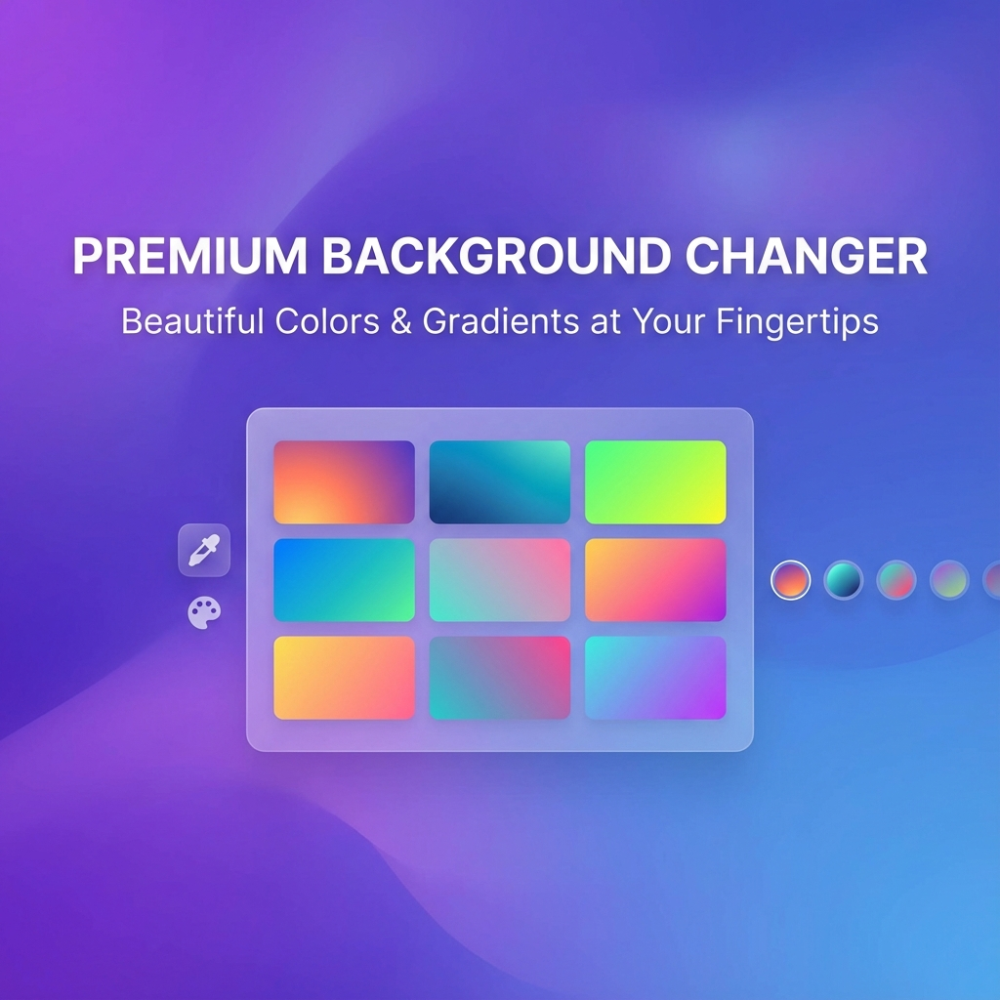
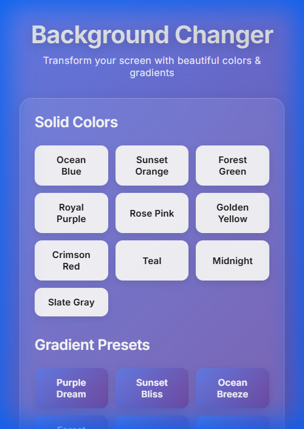
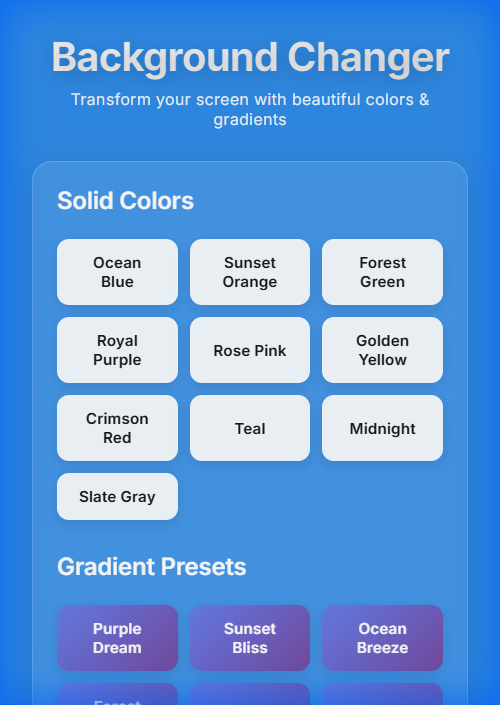
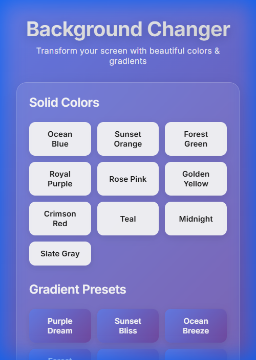
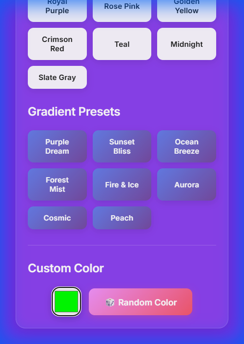

# 🎨 Premium Background Changer

<div align="center">



**Transform your screen with beautiful colors & gradients**

[](https://vuejs.org/)
[](https://vitejs.dev/)
[](LICENSE)

[Live Demo](#-demo) • [Features](#-features) • [Installation](#-installation) • [Usage](#-usage)

</div>

---

## ✨ Features

### 🎨 **Curated Color Palette**
- 10 handpicked solid colors with vibrant HSL values
- Ocean Blue, Sunset Orange, Forest Green, Royal Purple, and more
- Smooth 0.8s transitions between colors

### 🌈 **Beautiful Gradient Presets**
- 8 stunning gradient combinations
- Purple Dream, Sunset Bliss, Ocean Breeze, Fire & Ice, and more
- 135° angle for optimal visual appeal

### 🎯 **Custom Color Picker**
- Interactive color input for unlimited customization
- Instant background updates
- Large, accessible design

### 🎲 **Random Color Generator**
- AI-powered random color generation
- Controlled saturation (60-90%) and lightness (45-65%)
- Always produces vibrant, visually pleasing results

### 💎 **Premium Design**
- **Glassmorphism effects** with backdrop blur
- **Modern typography** using Inter font
- **Smooth animations** and micro-interactions
- **Responsive layout** for all devices
- **Zero lag** performance

---

## 📸 Demo

<div align="center">

### Initial Load - Glassmorphism Design


### Solid Color - Ocean Blue


### Gradient - Purple Dream


### Random Color Generator


</div>

---

## 🚀 Installation

### Prerequisites
- Node.js (v16 or higher)
- npm or yarn

### Setup

1. **Clone the repository**
   ```bash
   git clone https://github.com/Quantum-Fiend/Bg-Changer.git
   cd Bg-Changer
   ```

2. **Install dependencies**
   ```bash
   npm install
   ```

3. **Start development server**
   ```bash
   npm run dev
   ```

4. **Open in browser**
   ```
   http://localhost:5173
   ```

---

## 🛠️ Usage

### Development
```bash
npm run dev        # Start development server
npm run build      # Build for production
npm run preview    # Preview production build
npm run lint       # Run ESLint
```

### Project Structure
```
Bg-Changer/
├── src/
│   ├── App.vue          # Main Vue component
│   ├── main.js          # Application entry point
│   └── index.css        # Global styles & design system
├── public/              # Static assets
├── screenshots/         # Demo screenshots
├── index.html           # HTML template
├── vite.config.js       # Vite configuration
└── package.json         # Dependencies
```

---

## 🎨 Design System

### Color Palette
The application uses a carefully curated HSL-based color system for vibrant, consistent colors:

- **Ocean Blue**: `hsl(210, 80%, 55%)`
- **Sunset Orange**: `hsl(25, 85%, 60%)`
- **Forest Green**: `hsl(140, 60%, 45%)`
- **Royal Purple**: `hsl(270, 65%, 55%)`
- And 6 more beautiful colors!

### Gradients
All gradients use a 135° angle for optimal visual appeal:

```css
linear-gradient(135deg, #667eea 0%, #764ba2 100%)  /* Purple Dream */
linear-gradient(135deg, #fa709a 0%, #fee140 100%)  /* Sunset Bliss */
linear-gradient(135deg, #4facfe 0%, #00f2fe 100%)  /* Ocean Breeze */
```

### Glassmorphism
```css
background: rgba(255, 255, 255, 0.1);
backdrop-filter: blur(20px);
border: 1px solid rgba(255, 255, 255, 0.2);
```

---

## 🏗️ Built With

- **[Vue.js 3](https://vuejs.org/)** - Progressive JavaScript framework
- **[Vite](https://vitejs.dev/)** - Next generation frontend tooling
- **[Inter Font](https://fonts.google.com/specimen/Inter)** - Modern typography
- **Vanilla CSS** - Custom design system with CSS variables

---

## 📱 Responsive Design

The application is fully responsive with breakpoints for:
- **Desktop**: Full grid layout with all features
- **Tablet** (≤768px): Optimized grid with adjusted spacing
- **Mobile** (≤480px): 2-column layout for easy touch interaction

---

## ⚡ Performance

- **Fast Initial Load**: Optimized bundle with code splitting
- **Smooth Transitions**: 60 FPS animations using CSS transforms
- **Zero Lag**: Efficient event handling and DOM updates
- **Lightweight**: Minimal dependencies for fast load times

---

## 🤝 Contributing

Contributions are welcome! Please feel free to submit a Pull Request.

1. Fork the project
2. Create your feature branch (`git checkout -b feature/AmazingFeature`)
3. Commit your changes (`git commit -m 'Add some AmazingFeature'`)
4. Push to the branch (`git push origin feature/AmazingFeature`)
5. Open a Pull Request

---

## 📄 License

This project is licensed under the MIT License - see the [LICENSE](LICENSE) file for details.

---

## 👨‍💻 Author

**Quantum-Fiend**

- GitHub: [@Quantum-Fiend](https://github.com/Quantum-Fiend)

---

## 🙏 Acknowledgments

- Design inspiration from modern web design trends
- Color palette inspired by nature and digital art
- Built with ❤️ using Vue.js and Vite

---

<div align="center">

**If you found this project helpful, please give it a ⭐!**

Made with ❤️ by [Quantum-Fiend](https://github.com/Quantum-Fiend)

</div>
